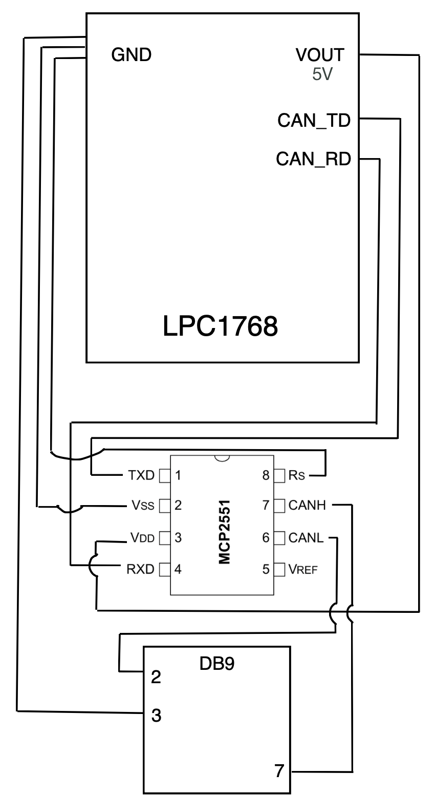
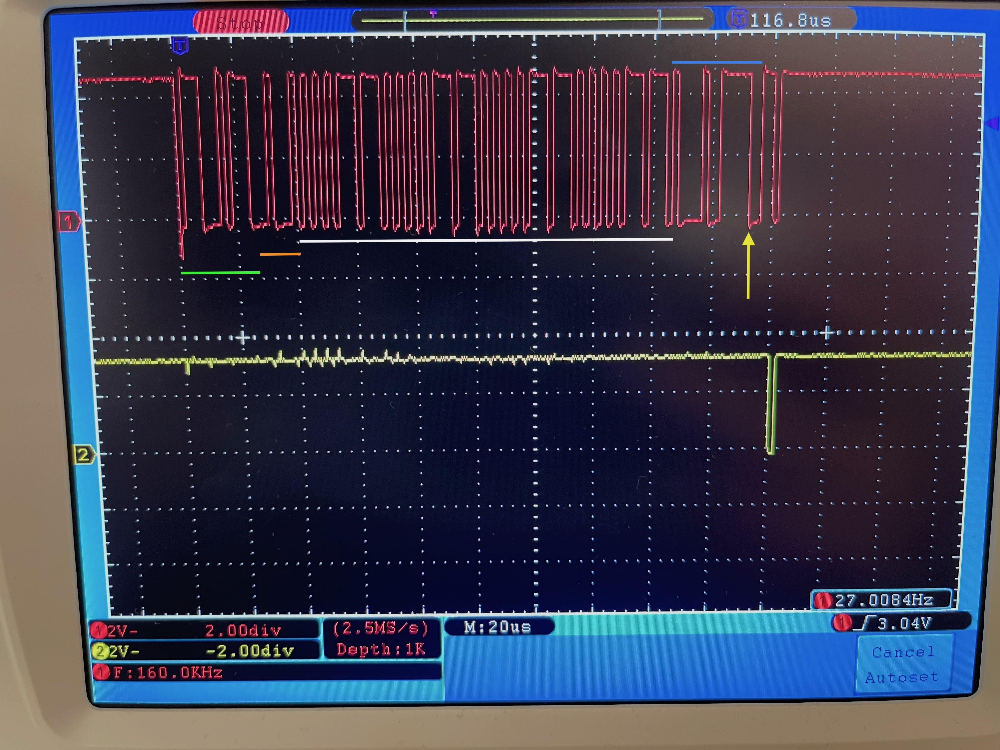
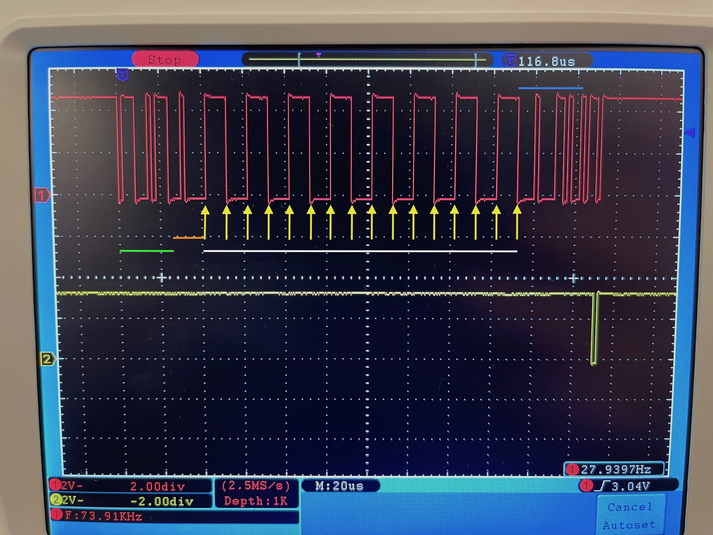

# P4: CAN
### Jesus Antoñanzas, Nico Ares | SEU, 2023

En aquesta pràctica utilitzarem el protocol CAN per comunicar el microprocessador LPC1768 i un ordinador. La primera part de la pràctica consisteix en el muntatge del circuit, i la segona en la programació del microprocessador. En la tercera, analitzem unes trames enviades.

### Part 1: muntatge del circuit

Basats en la documentació del transceptor CAN MCP2551 i la de l'interfície USB-CAN INNOMAKER, hem muntat el circuit següent:


<div style="text-align: center;">

</div>


### Part 2: programació del microprocessador

El programa que hem creat per aquesta pràctica és el següent:

```c++

#if !DEVICE_CAN
#error [NOT_SUPPORTED] CAN not supported for this target
#endif

#include "mbed.h"

DigitalOut led1(LED1);

CAN can1(p30, p29, 500000);

int main() {
    CANMessage msg;
    printf("main()\n\r");
    while (1) {
        if (can1.read(msg)) {
            printf("Message received: %d\n\r", msg.data[0]);
            led1 = !led1;
        }
    }
    wait_ms(2); // el clock del nostre micro va diferent
}

```

Funciona de la següent manera:
1. El programa inicialitza el client de bus CAN als pins del microprocessador corresponents, i amb la velocitat de comunicació adequada ($500 Kbps$), el micro espera a rebre missatges.
2. Quan rep un missatge, el micro ho mostra per pantalla.

### Part 3: anàlisi de trames

Connectem l'oscil·loscopi al cablejat CAN entre el MCP25512 i el micro. Enviem dos trames amb ID 717h i, per a cada una, identifiquem els camps, els bits de _stuffing_ i el CRC.

A les captures de l'oscil·loscopi ens fixem en els bits d'acknowledge del microprocessador, que són els que ens indiquen si el missatge ha arribat correctament. Per a contar els bits de stuffing (identificats amb fletxes grogues), mirem aquells bits que han sigut enviats després de 5 bits consecutius amb el mateix nivell. Per a identificar el CRC (marcat amb línea horitzontal blava), ens fixem en els 15 bits (sense comptar stuffing) que hi han després dels bits de dades (patró que es repeteix 8 cops a la senyal, assenyalat amb línea horitzontal blanca). Tot això ho fem apliant la captura i anant bit a bit (1 bit = 2us, ja que la velocitat la hem configurat a $500 Kbps$).

Les línes horitzontals verdes i taronges indiquen, respectivament, els arbitration fields i els bits de control. Els bits sense senyalar del final son end of frame.

#### Trama 1
- DATA = AA EE AA EE AA EE AA EE  

- Bits de stuffing: 1

- CRC (amb stuffing) = 0100001001111100
- CRC (sense stuffing) = 010000100111110



#### Trama 2
- DATA = 3C 3C 3C 3C 3C 3C 3C 3C

- Bits de stuffing: 16

- CRC (no té stuffing) = 000010000110100



